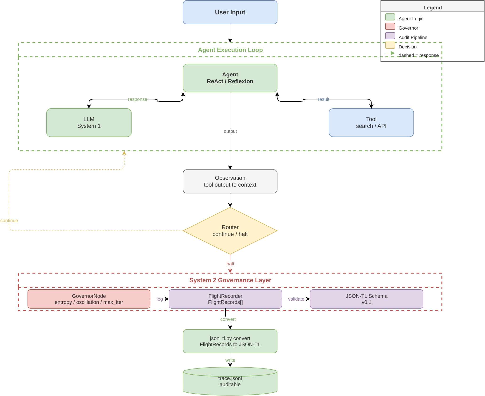

# GovernorNode 

**System 2 governance wrapper for LangGraph.**

GovernorNode injects deterministic safety rails into LLM agent loops — entropy monitoring, oscillation detection, plan-cost tracking, and halt policies. Ships with a JSON-TL flight recorder for auditable agent traces.

> *"OpenTelemetry for AI agents."*

---

## Why

LLM agents fail in predictable ways: loops, hallucination cascades, plan explosion. GovernorNode wraps your LangGraph `StateGraph` and catches these failures *before* they burn compute.

**What it catches:**
- **Oscillation** — agent bounces between the same 2–3 states
- **Entropy spikes** — outputs become incoherent (Shannon entropy > threshold)
- **Plan cost explosion** — cumulative `plan_cost` exceeds budget
- **Max iterations** — hard loop cap with graceful degradation

## Architecture

```
User Input → Agent (ReAct/Reflexion) → Observation → Router
                                                     ↓
                                        GovernorNode (halt/continue)
                                                     ↓
                                        FlightRecorder → JSON-TL → trace.jsonl
```



## Quick Start

```bash
pip install langgraph langchain-openai pyyaml
cd governornode-mvp
python examples/basic_usage.py
```

## Usage

### Wrap any LangGraph StateGraph

```python
from governornode import GovernorNode, GovernorConfig
from langgraph.graph import StateGraph

config = GovernorConfig.from_yaml("governance.yaml")
governor = GovernorNode(config)

# Wrap your existing graph
wrapped = governor.attach(your_state_graph)
```

### governance.yaml

```yaml
loop:
  max_iterations: 10
  oscillation_window: 5
  oscillation_threshold: 0.8

entropy:
  enabled: true
  threshold: 3.5
  window_size: 5

halt_on_violation: true
```

### Flight Recorder

Every run writes a `flight_recorder.json` — a complete audit trail of agent decisions:

```bash
# Convert to JSON-TL format
python json_tl.py convert flight_recorder.json -o trace.jsonl

# Validate a trace
python json_tl.py validate trace.jsonl

# Show trace info
python json_tl.py info trace.jsonl
```

## JSON-TL Schema

The JSON-TL (JSON Trace Language) schema defines an interoperable format for AI agent flight recordings. Think of it as **OpenTelemetry traces, but for LLM agents**.

- **RFC:** [json-tl-rfc.md](json-tl-rfc.md)
- **Schema:** [json-tl-schema.json](json-tl-schema.json)
- **Reference impl:** [json_tl.py](json_tl.py)

## Project Structure

```
governornode-mvp/
├── governornode/           # Core package
│   ├── __init__.py
│   ├── governor.py         # GovernorNode — the safety wrapper
│   ├── entropy.py          # Shannon entropy monitor
│   ├── oscillation.py      # State oscillation detector
│   ├── policies.py         # Halt policies
│   ├── config.py           # YAML config loader
│   └── flight_recorder.py  # JSONL audit trail
├── examples/
│   ├── governance.yaml     # Sample config
│   ├── basic_usage.py      # Minimal example
│   ├── react_loop.py       # Full ReAct loop with governor
│   ├── json-tl-example-trace.json
│   └── react-converted-trace.json
├── tests/
│   ├── test_governor.py    # 23 tests — governor + entropy + oscillation
│   └── test_json_tl.py     # 35 tests — schema validation + conversion
├── json_tl.py              # JSON-TL CLI (validate/convert/info)
├── json-tl-rfc.md          # JSON-TL RFC DRAFT v0.1
├── json-tl-schema.json     # JSON Schema (draft-04)
├── governornode-architecture.drawio  # Architecture diagram source
├── governornode-architecture.drawio.png
├── governornode-architecture.drawio.svg
├── SPEC.md                 # Full specification
└── setup.py
```

## Tests

```bash
pytest tests/ -v
# 58 tests passing
```

## Roadmap

- [ ] Git init + CI/CD
- [ ] `pyproject.toml` for PyPI packaging
- [ ] LangGraph native integration (PR)
- [ ] Multi-agent governor federation
- [ ] Real-time entropy dashboard

## License

MIT

## Tags

`langgraph` `ai-safety` `governance` `llm-agents` `observability` `opentelemetry` `flight-recorder` `json-tl` `agent-governance` `sre-for-ai`
